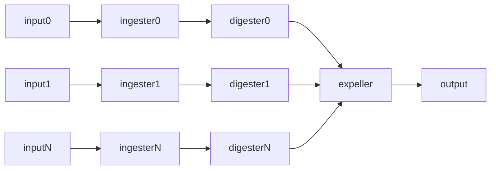

# Reservoird

Reservoird is an opinionated light weight pluggable streamm processing
framework written in golang

## Terminology

The following are the 4 plugin types

- ingester - how data is brought into reservoird
- digester - how data is transformed within reservoird
- expeller - how data is pushed out of reservoird
- queue - how data is passed through reservoird

## Data flow

